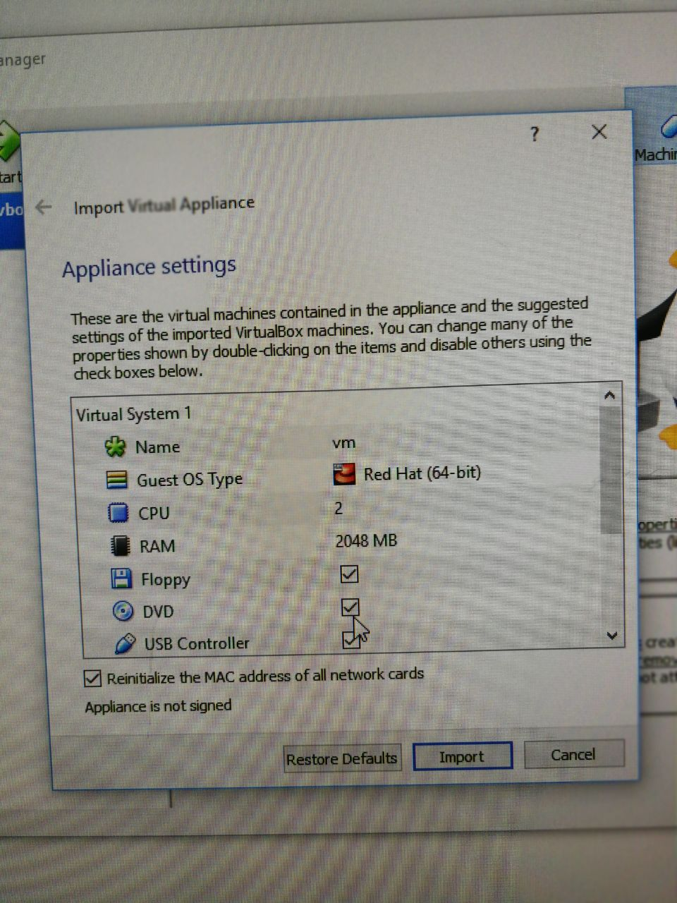
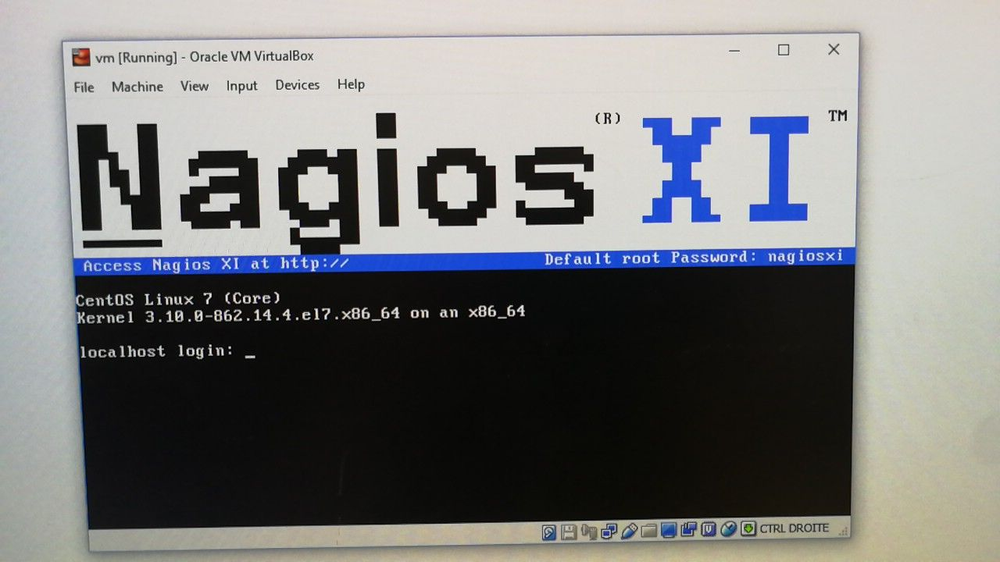
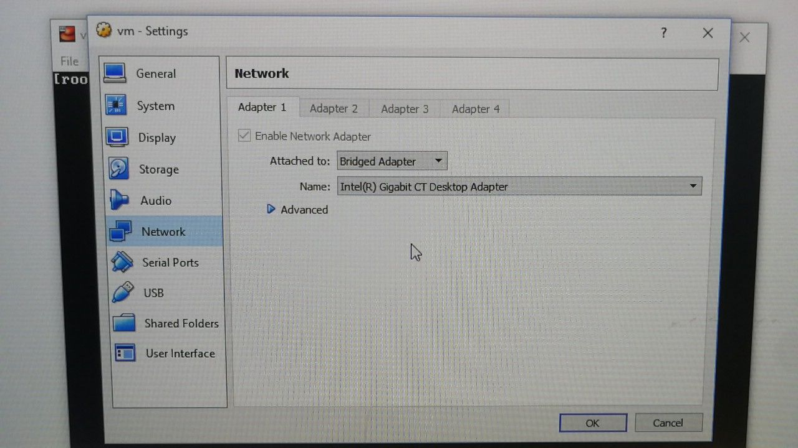
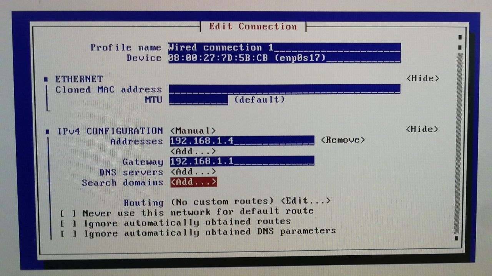
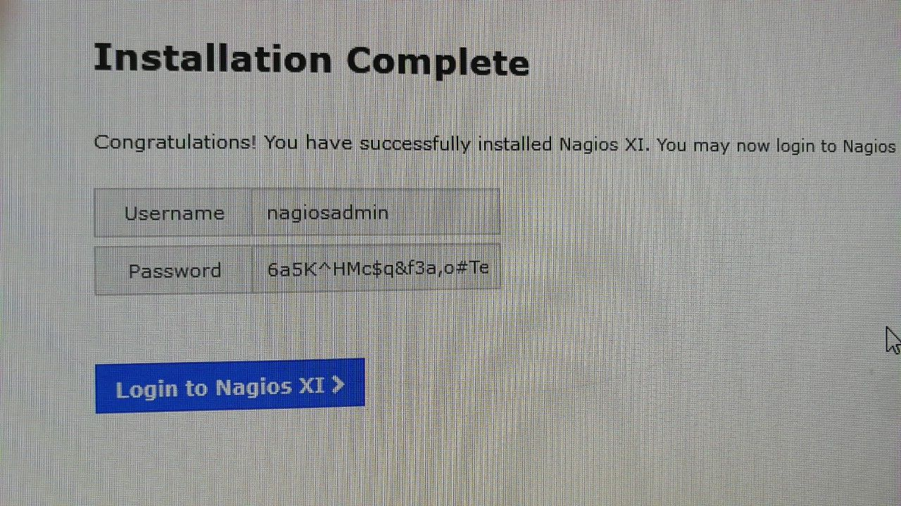

# Labo 3 Nagios

Joel Schär, Yann Lederrey, Yohann Meyer

## Objectif 1

On a fait la même chose que pour les derniers laboratoires.

Tout se ping parfaitement.

## Objectif 2

Tutoriel:

1. Télécharger la machine virtuel sur https://www.nagios.com/downloads/nagios-xi/vmware

2. double cliquez sur le fichier ova.

3. virtual box ouvre une page de settings, copiez les configurations suivantes.

   

4. faites un import.
5. Démarrez la vm se nommant vm
6. un login localhost est demandé : 

   1. mot de passe : nagiosxi



7. vérifiez que l'interface réseau de la machine virtuelle VirtualBox est en bridge.



8. vous pouvez changer la langue de votre clavier en effectuant la commande suivante : `vi etc/sysconfig/keyboard` ensuite attribuez la valeur fr_CH à la variable KEYTABLE. faites `:x` pour sauver vos changements.

   1. si le fichier n'existe pas, faites `localectl set-keymap ch-fr`

9. Attribuez une adresse ip fixe à votre machine virtuelle, pour cela :

   1. Lancez la commande suivante afin d'installer l'outil permettant la configuration réseau.

   2. ```
      nmtui
      ```

      3.  allez dans Edit a connection
      4. allez dans wired connection
      5. configurez une adresse ip fixe dans IPv4 CONFIGURATION passez en manual

   

## Objectif 3

1. Allez sur http://<<monIpNagios>>/nagiosxi/install.php



(mot de passe changé -> "admin")

2. Loguez vous avec votre username, password.

3. Allez sur configure => configure wizard

4. chechez network switch routeur 

5. configurez.

6. choisir l'ip de du router

   

   


   

7. On fait la même manipe pour le switch

   

   
   

8. On fait la même manipe pour le Dell 9020

   Pour ce faire on va utiliser "windows SNMP"
   Il faut installer un agent disponible en téléchargement depuis la console de nagios.
   


On peut maintenant voir les différents hosts dans la consôle.


#### question 3

Deux moyens possible pour faire la découverte des hôtes est d'utiliser SNMP ou de faire un simple ping vers toutes les adresses IP.

## Objectif 4

Pour l'auto découverte de la machine windows.


Une fois toutes la configuration faites, nous ne pouvions tout de même pas avoir accès aux données de la machine. Nous avons donc refait la configuration manuellement avec "windwos SNMP".


#### question 4

Il est possible de monitorer les services suivant.


#### quesiton 5 - 6

Après avoir changé le réseau du serveur nagios sur le réseau de l'école et remis la carte réseau en mode DHCP on peut faire une découverte de tous les devices du réseau.


Vu que les services sont bloqués sur le réseau de l'école, nous ne pouvons pas identifier les services tournant sur les machines détectées. Nous pouvons tout de même supposer le rôle des serveurs :

- DHCP
- code check
- téléinfo

## Objectif 5

- La supervision réseau (SMTP, POP3, HTTP, NNTP, PING)
- La supervision de ressources systèmes (charge processeur, état de disques, nombre d'utilisateurs connectés, process)
- La supervision d'applications.
- La notification par différents moyens de communications (SMS, mail, wap)
- L' exécution de commandes manuelles ou automatiques
- La représentation des états de ressources supervisées, par coloration.
- La cartographie du système d'information supervisé
- Le reporting