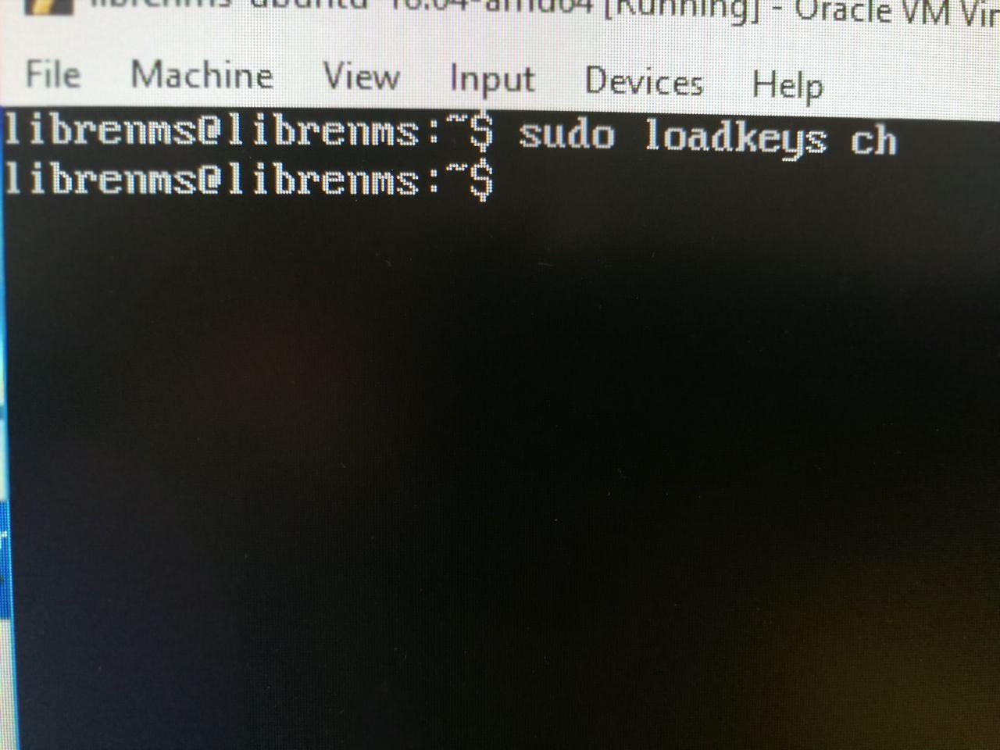

# Labo 4 LibeNMS

Joel Schär, Yann Lederrey et Yohann Meyer

## Objectif 1: Construire le réseau et réaliser la configuration de base des équipements.

1. Connecter la machine utilisée sur le réseau Bleu.
2. Configurer la carte réseau de cette machine en mode DHCP.
3. Pour que la machine puisse recevoir des requêtes SNMP, il faut activer le service "SNMP service" et dans les propriétés, aller autoriser les requêtes avec la community string "public". 
   

## Objectif 2 : Configurer la vm avec les serveur LibreNMS

1. Ouvrir la vm sur Virtualbox. (Avec VmWare il faut faire beaucoup de configuration réseau et ce n'est pas très pratique. Nos collègues en ont fait l’expérience. )
2. Configurer la carte réseau sur bridge.
3. Se connecter sur la vm avec les credentials fournis.

- username : librenms
- password: CDne3fwdfds

4. Changer le clavier vers le clavier suisse avec commande `sudo loadkeys ch`

## Objectif 3, Monitoring d'un réseau

1. Installer python `sudo apt install python`

2. Il faut lancer le script `snmp-scan.py`sur le réseau d'ont fait partie l'ip de notre vm.
   `python3 snmp-scan.py 10.192.72.0/23`
   

   Il faut attendre 2-3 minutes pour le scan soit terminé.

3. Accéder ensuite à l'adresse du serveur LibreNSM ( chez nous à l'adresse `10.192.72.106` ) dans un navigateur.
   Utiliser les crédentials fournis :
   - username : librenms
   - password: CDne3fwdfds

4. Aller dans l'onglet `device` pour voir le résultat du scan.

   

#### Question 2 

1. 10.192.72.121
   1. Health

      

   2. Ports

   3. General infos

   4. Disque usages
2. 10.192.71.92

   1. Net State
   2. Les Ports
   3. General infos
   4. Performance

## Objectif 4

#### Question 3

1. Lister la localisation des machines.

`-> Devices -> Geo Locations -> All Locations `

2. "Health", permet de voir la santée des toutes les machines sur plusieurs points en un seul coup d'oeil.

   

   

3. Lister les ports de toutes les machines.
   

4. Dashboard flexible

#### Question 4

Nous voyons bien les possibilités que pourrait offrir LibeNMS dans le cadres de la surveillance d'un réseau. Il permet de mettre a disposition rapidement les informations et l'état de santé du réseau. Cela facilite le travail de l'ingénieur et voila.